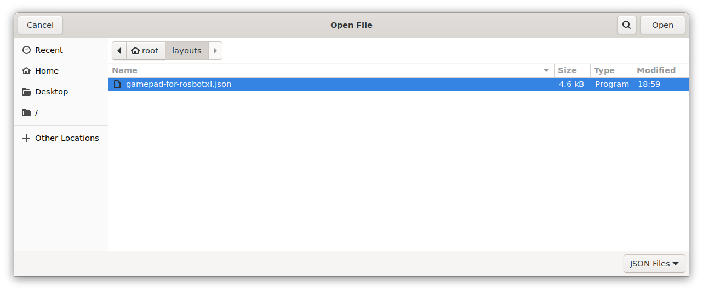

## Quick start

Connect the Logitech F710 gamepad to your PC. Open a terminal on your PC and run:

```bash
just sync rosbotxl # rosbotxl - husarnet hostname, you can replace it with local IP address
```

In a separate window run:

```bash
ssh husarion@rosbotxl # rosbotxl - husarnet hostname, you can replace it with local IP address
```

In the ROSbot terminal type:

```bash
cd rosbot-xl
just flash
# wait until the right firmware is flashed
just rosbot
```

Open a new terminal window on your PC and run:

```bash
just foxglove nvidia
# or if you don't have nvidia GPU
# just foxglove
```

And setup Foxglove UI:

1. Click the **Open connection** button


2. Modify `ws://localhost:8765` with the hostname/ip of ROSbot XL, eg. `ws://rosbotxl:8765` and click the **Open** button


3. Load the layout: click the **upper-left button** > **View** > **Import layout from file...**


4. Navigate to `/root/layouts` folder (eg. click **Home** > **layouts**) and select the `*.json` file



5. Setup the Joystick panel (the setup is not loaded automatically):
   - Select `Gamepad` as the **Data Source**
   - Select `On` in the **Publish Mode**
   - Select `Custom Display` in the **Display Mode**


6. Click the **Enable Movement** key on the Logitech F710 gamepad and move around with the **left gamepad knob**

